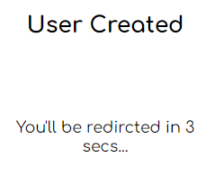
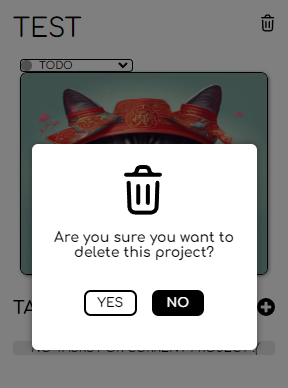

# ProApp
ProApp is a full-stack web application designed for efficient task and project management with a user-friendly interface.

## Table of Contents
- [Features](#features)
- [Tech Stack](#tech-stack)
- [Installation](#installation)
- [Usage](#usage)
  - [Run the App Locally](#run-the-app-locally)
    - [Frontend](#frontend)
    - [Backend](#backend)
  - [Visit the Live Demo](#visit-the-live-demo)
  - [Registering a New Account](#registering-a-new-account)
- [Footer Menu](#footer-menu)
- [Adding Your First Project](#adding-your-first-project)
- [Changing Your Project's Status](#changing-your-projects-status)
- [Changing Your Project's Image](#changing-your-projects-image)
- [Deleting Your Project](#deleting-your-project)
- [Adding Tasks To Your Project](#adding-tasks-to-your-project)
  - [Task’s Expanded View](#tasks-expanded-view)
- [Search Projects](#search-projects)
- [User Page](#user-page)
  - [Change Your User Image](#change-your-user-image)
- [Users Page (Admin Feature)](#users-page-admin-feature)
- [API Routes](#api-routes)
  - [User Routes](#user-routes)
    - [General User Routes](#general-user-routes)
    - [Admin User Routes](#admin-user-routes)
  - [Project Routes](#project-routes)
    - [General Project Routes](#general-project-routes)
    - [Admin Project Routes](#admin-project-routes)
- [Acknowledgements](#acknowledgements)
- [License](#license)

## Features

### **General User Features**
- **Account Management**
  - Register with an email, password, and username.
  - Secure login and logout using JWT.
  - View and edit user profile (update avatar, view personal details like ID, username, email).
- **Dashboard**
  - Manage personal projects and tasks (create, update, delete).
  - Search projects by name.
  - Visualize statistics with **2 pie charts** (project statuses: Todo, In-Progress, Done and task statuses).
  - Real-time updates for projects and tasks.
  - Responsive design for mobile and desktop.

### **Admin Features**
- **User Management**
  - View all users in a sortable directory.
  - Sort by username, total projects, or project statuses (Todo, In-Progress, Done).
  - View user details (ID, username, email) and project statistics.
  - Access individual user pages with detailed stats and **2 pie charts**.
- **Project and Task Management**
  - Add, update, delete, and manage statuses for other users’ projects and tasks.
  - Update project images.
- **Search and Filter**
  - Search projects by owner’s username.

## Tech Stack

**Frontend:**  
- **Framework/Library:** React  
- **State Management:** Redux Toolkit (@reduxjs/toolkit), React-Redux  
- **Routing:** React Router DOM  
- **HTTP Requests:** Axios  
- **Charts/Graphs:** Recharts  
- **Styling:** Styled Components  
- **SEO Management:** React Helmet  
- **Icons:** React Icons  

**Backend:**  
- **Server Framework:** Express  
- **Database:** MongoDB (with Mongoose for object data modeling)  
- **Authentication:** JSON Web Tokens (JWT), bcryptjs for password hashing  
- **Environment Variables:** dotenv  
- **Security:**
  - CORS for cross-origin resource sharing
  - MongoDB data sanitization with express-mongo-sanitize and mongo-sanitize
  - Input sanitization with sanitize-html
- **Error Handling:** express-async-handler

**Deployment:**  
- **Frontend:** Netlify  
- **Backend:** Render.com  
- **Module Bundler:** Vite (Frontend)  
- **Linting:** ESLint (with React and React Hooks plugins)  
- **Hot Reloading:** Vite React Plugin  

---

## Installation

1. **Clone the repository:**
    ```bash
    git clone https://github.com/Nickk91/ProApp
    cd ProApp
    ```

2. **Install dependencies for both frontend and backend:**

    ### **Backend Setup**
    ```bash
    cd pro-app-backend
    npm install
    ```

    ### **Frontend Setup**
    ```bash
    cd ../client
    npm install
    ```

3. **Create a `.env` file** in the root of the `pro-app-backend` folder and add the following variables:
    ```plaintext
    # MongoDB Connection Strings
    MONGO_URI=your_mongodb_connection_string_for_development
    MONGO_URI_PROD=your_mongodb_connection_string_for_production

    # Server Configuration
    PORT=3000
    ENV="development"
    
    # Authentication
    ACCESS_TOKEN_SECRET=your_jwt_secret_key

    # URLs
    BACKEND_URL=your_backend_url_for_production
    PRODUCTION_FRONT_URL=your_frontend_url_for_production
    BASE_SERVER_URL=http://localhost
    CLIENT_PORT=5173
    ```

## Usage

### **Run the App Locally**
To run the app locally, open **two terminals**:

#### **Frontend**

1. Navigate to the frontend folder:
    ```bash
    cd client
    ```
2. Start the development server:
    ```bash
    npm run dev
    ```
3. The console should display a message similar to the following:
    ```
    VITE ready in [build time] ms

    ➜  Local:   http://localhost:5173/
    ➜  Network: use --host to expose
    ➜  press h + enter to show help
    ```

#### **Backend**

1. Navigate to the backend folder:
    ```bash
    cd pro-app-backend
    ```
2. Start the server with file watching:
    ```bash
    node --watch server.js
    ```
3. The console should display:
    ```
    Server is running on PORT 3000
    ```

You can now access the app at [http://localhost:5173/](http://localhost:5173/) in your browser.

---

### **Visit the Live Demo**

1. Visit the live demo: [Live Demo](https://proappdevenv.netlify.app/)
2. To log in as an **admin**, use the following credentials:
    - **Email**: mrcoffee@gmail.com
    - **Password**: secretPass30#

---

### **Registering a New Account**

1. Click on the **Register** button on the login page (you will be redirected there if logged out).

   - **Login Screenshot**  
     
     

2. Fill in the registration form:
   - **Step 1**: Provide your email and create a password.
     - **Password requirements**:
       - 8–64 characters
       - At least one lowercase letter
       - At least one digit
       - At least one special character (!@#$%^&*)
   
   - **Register Screenshot**  
     
     

   - **Step 2**: Choose a username.
     - **Username requirements**:
       - 15 characters or fewer
       - Only English letters, numbers, and underscores

   - **Signup Screenshot**  
     
     

3. Click **Next** to complete your registration.

4. If your registration was successful, you will be redirected to a **Register Success** page.

   

5. After a 3-second countdown, you will be redirected to the **Login** page.

---

### **Footer Menu**

Once you’ve logged in, you’ll see a **Footer Menu** at the bottom of every page (except the login/register pages). The available buttons may vary depending on whether you’re a **regular user**:


or an **admin**:


- **Home Button**  
  Navigates to your **Projects** page.  
  - If you have no projects yet, it navigates to the **No Projects** page.

- **Search Button**  
  Navigates to the **Search** page, where you can search your own projects by name.  
  - **Admins** can also search by the project owner’s username.

- **Plus Button**  
  Navigates to the **Add Project** page, allowing you to quickly create a new project.

- **User Button**  
  Navigates to your **User Page**, showing personal details and project/task stats.

- **Users Button** *(Admin Only)*  
  Navigates to the **Users Page**, where admins can view all users in a card-based layout, along with their stats.

- **Logout Button**  
  Logs you out of your account with one click.

---

### **Adding Your First Project**

After logging in for the first time, you’ll have **no projects** assigned to your user.  
You’ll be prompted to add your first project by clicking the **Plus Button** on the “No Projects” page.  
You can also add a project at any time by clicking the **Plus Button** on the **Footer Menu**.

After clicking the button, you’ll be navigated to the **Add Project** page, where you’ll need to fill in the following inputs:

- **Project Name**  
  - 30 characters or fewer  
  - Only English letters, numbers, and underscores

- **Project Description**  
  - 120 characters or fewer  
  - Only English letters, numbers, and underscores

- **Project Image URL**  
  - Must be a valid URL

After successfully adding the project, you’ll be taken to the **Project** page.

---

### **Changing Your Project's Status**

Inside your project page, beneath the project name, you’ll see a **Status Selector**. The default status is **TODO**. By clicking this selector, you can choose one of three different statuses:

- **TODO**  
- **IN PROGRESS**  
- **DONE**

---

### **Changing Your Project's Image**

Inside your project page, click on the project’s image. A modal will open, asking you to enter the **URL** of your new image. Click **Accept** to confirm your choice.

**Image Modal**:  


**New User Image**:  


---

### **Deleting Your Project**

In your project page (top-right corner), you’ll see a **Trash Icon**. Clicking it opens the **Delete Modal**, where you can confirm deletion of the project by clicking **YES**, or cancel by clicking **NO**.



After deleting the project, you’ll be taken back to the **My Projects** page.

---

### **Adding Tasks To Your Project**

Inside your project page, beneath the project image (bottom-right corner), you’ll see a **Plus Button**. Clicking this button redirects you to the **Add Task** page, where you must fill in the following inputs:

- **Task Name**  
  - 30 characters or fewer  
  - Only English letters, numbers, and underscores

- **Task Description**  
  - 120 characters or fewer  
  - Only English letters, numbers, and underscores

- **Task Status Selection**  
  You must choose one of three statuses:
  - **TODO**  
  - **IN PROGRESS**  
  - **DONE**

After clicking **ADD TASK**, you’ll be taken back to the project page, which will now display your newly added task at the bottom.

#### **Task’s Expanded View**

By default, tasks appear in a **non-expanded** view, showing only the task’s name and current status:


To view the **expanded** version (which also displays the task’s description), click the **Arrow Button** at the bottom-right corner of the task:


---

### **Search Projects**

To search for a specific project, click the **Search Button** to open the **Search Page**.

- **Regular User**:  
  You can search for projects by their names.  
  1. Enter the keyword(s) in the text input.
  2. Click **Search**.
  3. Matching projects will appear at the bottom of the page if the project name includes your search term.

  

  

- **Admin User**:  
  In addition to searching by project name, you can also search by the **username** of the project owner.  
  1. Click **USERNAME**.
  2. Enter the keyword(s) in the text input.
  3. Click **Search**.
  4. Any project owned by a user whose username contains your search term will appear.

  

---

### **User Page**

By clicking the **User Button** on the **Footer Menu**, you’ll be navigated to your personal **User Page**:


On this page, you’ll find:

- Your **User Image**  
- Your **User Details** (username, email, user ID)
- A **Plus Button** to add a project
- A **User Projects** button to navigate to the **Projects** page
- A **User Projects Pie Chart** displaying the breakdown of project statuses (TODO, In-Progress, Done)
- A **User Tasks Pie Chart** showing the breakdown of task statuses (TODO, In-Progress, Done)

---

#### **Change Your User Image**

By clicking on your **User Image**, a modal will open asking you to enter the URL of your new image. Click **Accept** to confirm your choice.

**Image Modal**:  


**New User Image**:  


---

### **Users Page** (Admin Feature)

By clicking the **Users Button**, you’ll be taken to the **Users Page**:


At the top of the page, you’ll see a strip of **Sort Buttons**:
- **Sort by Username**
- **Sort by Project Quantity**
- **Sort by Todo Project Quantity**
- **Sort by In-Progress Project Quantity**
- **Sort by Done Project Quantity**

#### **Sort Buttons**


Below this strip, you’ll find **User Cards** stacked vertically:


#### **User Card**
By clicking any **User Card**, you’ll be navigated to that user’s page.

#### **Pagination Buttons**
At the bottom of the page are **Pagination Buttons**, which let you navigate through additional user cards:


---

## **API Routes**

### **User Routes**
All user-related operations are prefixed with `/api/pro-app/users`.

#### **General User Routes**
| **HTTP Method** | **Endpoint**                                       | **Description**                                     | **Requires Auth**     |
|-----------------|----------------------------------------------------|-----------------------------------------------------|-----------------------|
| **POST**        | `/api/pro-app/users/register`                      | Create a new user account                           | No                    |
| **POST**        | `/api/pro-app/users/userexist`                     | Check if a user already exists                      | No                    |
| **POST**        | `/api/pro-app/users/login`                         | Log in an existing user                             | No                    |
| **GET**         | `/api/pro-app/users/current`                       | Fetch the currently logged-in user’s data           | Yes (`validateToken`) |
| **PATCH**       | `/api/pro-app/users/update-pic`                    | Update the currently logged-in user’s profile image | Yes (`validateToken`) |
| **POST**        | `/api/pro-app/users/test-sanitize`                 | Test endpoint for request sanitization (debugging)  | No                    |
| **GET**         | `/api/pro-app/users/search/getuserid/:userName`     | Find user(s) by `userName` and fetch associated user projects | No (or Yes, if preferred) |
| **GET**         | `/api/pro-app/users/:id`                            | Get a single user by ID                             | No (or Yes, if preferred) |

#### **Admin User Routes**
| **HTTP Method** | **Endpoint**            | **Description**        | **Requires Auth**                         |
|-----------------|-------------------------|------------------------|-------------------------------------------|
| **GET**         | `/api/pro-app/users`    | Fetch all users        | Yes (`validateToken`, `validateAdmin`)    |

> **Notes:**
> - `validateToken` indicates JWT authentication is required for that route.
> - `validateAdmin` indicates that only admin users can access that route.
> - Adjust any route as **admin-only** if needed.

---

### **Project Routes**
All project-related operations are prefixed with `/api/pro-app/projects`.

#### **General Project Routes**
| **HTTP Method** | **Endpoint**                                                 | **Description**                                    | **Requires Auth**     |
|-----------------|--------------------------------------------------------------|----------------------------------------------------|-----------------------|
| **DELETE**      | `/api/pro-app/projects/:id`                                  | Delete a project by its ID                         | Yes (`validateToken`) |
| **GET**         | `/api/pro-app/projects`                                      | Fetch all projects                                  | No                    |
| **POST**        | `/api/pro-app/projects/addproject`                           | Create a new project (regular user)                 | Yes (`validateToken`) |
| **GET**         | `/api/pro-app/projects/user/:id`                             | Fetch all projects for a specific user by user ID    | Yes (`validateToken`) |
| **GET**         | `/api/pro-app/projects/user`                                 | Fetch all projects for the currently logged-in user | Yes (`validateToken`) |
| **GET**         | `/api/pro-app/projects/user/searchprojects`                  | Search user’s projects by user ID (variant)         | Yes (`validateToken`) |
| **POST**        | `/api/pro-app/projects/project/:id/addtask`                  | Create a new task under a specific project          | Yes (`validateToken`) |
| **PATCH**       | `/api/pro-app/projects/project/:id/edit-task`                | Edit an existing task by task ID                    | Yes (`validateToken`) |
| **PATCH**       | `/api/pro-app/projects/project/:id/change-pic`               | Change the project’s image                          | Yes (`validateToken`) |
| **GET**         | `/api/pro-app/projects/project/:id`                          | Fetch a single project by project ID                | Yes (`validateToken`) |
| **GET**         | `/api/pro-app/projects/project/user/:userIdsArray`           | Fetch a project by multiple user IDs (param-based)   | No (or Yes, if preferred) |
| **PATCH**       | `/api/pro-app/projects/:id/deletetask`                       | Delete a task by task ID                            | Yes (`validateToken`) |
| **PATCH**       | `/api/pro-app/projects/:id/taskstatus`                       | Update a task’s status by task ID                   | Yes (`validateToken`) |
| **PATCH**       | `/api/pro-app/projects/:id`                                  | Update a project’s status by project ID             | Yes (`validateToken`) |

#### **Admin Project Routes**
| **HTTP Method** | **Endpoint**                                                                                   | **Description**                                               | **Requires Auth**                          |
|-----------------|------------------------------------------------------------------------------------------------|---------------------------------------------------------------|--------------------------------------------|
| **POST**        | `/api/pro-app/projects/addprojectbyadmin`                                                      | Create a new project on behalf of a user (admin only)        | Yes (`validateToken`, `validateAdmin`)    |
| **GET**         | `/api/pro-app/projects/project/projectname/:searchItem`                                        | Search projects by name                                       | Yes (`validateToken`, `validateAdmin`)    |
| **GET**         | `/api/pro-app/projects/project/projectname-and-id/:searchItem/:userId`                        | Search a user’s projects by project name *and* user ID        | Yes (`validateToken`, `validateAdmin`)    |

> **Notes:**
> - Some routes are **admin-only** (e.g., `/addprojectbyadmin`).
> - `validateToken` indicates JWT authentication is required.
> - `validateAdmin` indicates that only admin users can access that route.
> - Adjust your authentication and route access according to your app’s logic.

---

## **Acknowledgements**

I would like to extend my heartfelt gratitude to the following individuals who contributed to the development of **ProApp**:

- **Elad Harel** ([eladjmc](https://github.com/eladjmc)):  
  My instructor at Apple Seeds Full Stack Bootcamp. Elad was instrumental in conceptualizing and designing the initial framework of ProApp. His guidance and early assistance with the code were invaluable during the initial phases of development.

- **Michael Braginski**:  
  A special thanks to Michael for dedicating his time to help me troubleshoot and resolve a persistent bug. His expertise and willingness to assist were greatly appreciated.

---

## **License**


This project is licensed under the [MIT License](LICENSE).

---
